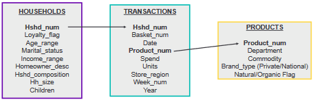

```{r libraries, warning=FALSE, include=FALSE}
#load needed libraries
library(tidyverse)
library(lubridate)
library(magrittr)
library(gridExtra) 
library(modeest)
library(knitr)
library(kableExtra)
library(latticeExtra)
library(arules)
library(arulesViz)
library(treemap)
```
```{r, include=FALSE}
#Setting wd and loading data
#put the path of where you are storing the data on your computer
paths = c('C:/Users/eliza/Documents/BANA 7047 - Data Mining II/Group Project/Data', 'C:/Users/ashle/Downloads/8451_The_Complete_Journey_2_Master (1)/The_Complete_Journey_2_Master', 'C:/Users/xiaoj/Desktop/BANA/BANA7047 Data Mining II/Project/8451_The_Complete_Journey_2_Master/The_Complete_Journey_2_Master')
#use the code Sys.info()[7] to find out how your name is stored on your local machine, copy to this list
names(paths) = c('eliza', 'ashle', 'xiaoj')
#this will set the wd
setwd(paths[Sys.info()[7]])

load(file = "organic_households.Rdata")
load(file = "market_basket.Rdata")
load(file = "household_increase.Rdata")
```
# Introduction

Understanding what drives customers to buy organic products is key as in many segments the market growth of organic products is outstripping that of the overall segment. Organic products also represent billions of dollars in sales and the availability of orgnic products is a key factor in why some consumers pick one grocery store over another.

A recent report from the Organic Trade Association stated that the U.S. market for organic products was \$52.2 billion and accounted for 5.7% of all food sales in the United States in 2018. They reported that the majority of organic food sales were fruits and vegetables, accounting for $17.4 billion in sales; dairy and eggs made up the second-largest organic food category at \$6.5 billion in sales. Sales of organic fruits and vegetables grew by 5.6% which far surpassed the growth of the overall fruit and vegetable market at 1.7%. Non-food organic products saw 10.6% overall growth from 2017 to 2018 also surpassing the growth of the overall non-food segment at 3.6% (Redman). And recent polling by IRI, a consumer research company, found that 49% of Millennials and 40% of Gen X shoppers consider having a good selection of natural and organic foods important in selecting a grocery store (Emarketer). 

For this project, we are acting as a team of analysts who are interested in identifying households that are likely to buy organic products so we know who to target for an organic product marketing campaign. In order to do this, we will use data at both the household and basket level and try classification models to accurately identify these households. We are also interested in organic trends over time and will use a classification model to attempt to flag households who have increased their spending on organic products in year two. Finally, we will use market basket analysis to mine for association rules to give insight on organic products frequently bought together. 

## The Data

The data set we are using for our project is called "The Complete Journey 2.0" and it is found on the 84.51 website (84.51). This data set has transactions at the household level from a group of 5,000 households over a two year period. This is a relational data set comprised of household data, transaction data, and product data that can be combined by household and product IDs. The household data set has demographic information such as the size, income, and age of the  household.The transaction data set is made up of over 10 billion rows; each row represents one item purchased by a customer and provides an ID for the item purchased, the household who purchased it, a 'Basket' ID which groups items purchased in the same transation, and information like the the date purchased and cost of the item. The product data set links to the transaction data set by the product ID and gives some high level information on each product including the product category, whether a product is organic, and whether the product is a private or national brand. 

A graphical representation of the structure of our data set is displayed in Figure X.


## Major Findings

#Predicting Organic Households
The goal for this part of the analysis is to come up with a classification model that can help predict whether a household will buy organic products. An "organic household" subset of the original data sets was created with the dependent variable being "ORG_HOUSE" (1 if the household has purchased an organic product, 0 if not). This data set contains only complete observations and includes the demographic data from the households data set as well as the amount spent, total units purchased, and unique purcahsed for both organic and non-organic products. This data set has a total of 3,370 observations and 16 variables. 

Looking at the summary of the data, 2,791 households have purchased an organic product (this is about 83% of the data set). Because a household will qualify as an "organic household" even if they've only purchased one organic product, this percentage is very high. To make the model more realistic, this variable has been re-coded to qualify any household that purchases at least 10% of their total project organic. Using this method, only about 9% of the data set is considered an organic household, but these are the households we would most want to identify because the marketing promotions will be the most relevant to them.

```{r re-code ORG_HOUSE}
#convert ORG_HOUSE to factor
organic_households$ORG_HOUSE <- as.factor(organic_households$ORG_HOUSE)

#see what percentage of data set is organic
table(organic_households$ORG_HOUSE)
#only about 9%

#delete hshd number variable bc it is a unique id not used in analysis
organic_households <- organic_households[,-1]
```

Through some initial EDA, we can see that households with higher incomes tend to purchase more organic products. It also appears that younger age ranges buy more organic products which makes sense, seeing as how buying organic is a sort of trend among younger generations. 

```{r org household EDA, echo=FALSE}
org.income <- ggplot(organic_households, aes(fill=ORG_HOUSE, y=nrow(organic_households), x=INCOME_RANGE)) + 
    geom_bar(position="fill", stat="identity")

org.age <- ggplot(organic_households, aes(fill=ORG_HOUSE, y=nrow(organic_households), x=AGE_RANGE)) + 
    geom_bar(position="fill", stat="identity")

org.marital <- ggplot(organic_households, aes(fill=ORG_HOUSE, y=nrow(organic_households), x=MARITAL)) + 
    geom_bar(position="fill", stat="identity")

org.kids <- ggplot(organic_households, aes(fill=ORG_HOUSE, y=nrow(organic_households), x=CHILDREN)) + 
    geom_bar(position="fill", stat="identity")


par(mfrow=c(2,2))
org.income
org.age

```

The first method used in trying to classify organic households is logistic regression. The data set was split into 70% training and 30% testing sets and an initial model was run with ORG_HOUSE as the dependent variable and relevant demographic variables as predictors: age range, income range, marital status, homeowner status, household size, and number of children. Income ranges 100-150k and 150k+ are the most significnat variables from this output. The AIC of this initial model is 1384.011 and the BIC is 1493.565. The in-sample and out-of-sample ROC curve can be seen below. The in-sample AUC is 0.6475069 and the out-of-sample AUC is 0.6126708 meaning that this model is doing better than randomly guessing at classifying organic households, but there is still room for improvement. 


```{r logistic regression initial model}

#split data into training and testing sets
set.seed(8817349)
index <- sample(nrow(organic_households),nrow(organic_households)*0.70)
org.train = organic_households[index,]
org.test = organic_households[-index,]

#train logistic regression model using demographic variables
org.glm0<- glm(ORG_HOUSE~AGE_RANGE+MARITAL+INCOME_RANGE+HOMEOWNER+HH_SIZE+CHILDREN, family=binomial(link="logit"), data=org.train)
summary(org.glm0)

#criteria for model fitting
org.glm0$deviance #1346.011
AIC(org.glm0) #1384.011
BIC(org.glm0) #1493.565
```
```{r in sample prediction, include=TRUE}
#prediction
#ROC curve for in sample data
pred.glm0.train <- predict(org.glm0, type="response") 

library(ROCR)
pred <- prediction(pred.glm0.train, org.train$ORG_HOUSE) 
perf <- performance(pred, "tpr", "fpr") 
plot(perf, colorize=TRUE, main="In-Sample ROC") 

#In Sample AUC
unlist(slot(performance(pred, "auc"), "y.values")) 
#0.6475069
```
```{r out of sample prediction, include=TRUE}
#out of sample prediction
pred.glm0.test<- predict(org.glm0, newdata = org.test, type="response") 

#ROC curve
pred <- prediction(pred.glm0.test, org.test$ORG_HOUSE) 
perf <- performance(pred, "tpr", "fpr")
plot(perf, colorize=TRUE, main="Out of Sample ROC")

#Get the AUC
unlist(slot(performance(pred, "auc"), "y.values"))
#0.6126708
```

Backwards selection was used to narrow down the number of variables used in the model. Now there are 7 predictors chosen and all are significant (maritalSingle, income 35-49k, income50-74k, income 75-99k, income 100-150k, income 150k+, and children). The AIC of this reduced model is 1374.652 and the BIC is 1420.78. The in-sample and out-of-sample AUC's are 0.6314394 and 0.6063656 respectively. Although the AUC is slightly lower than the initial model, this model performs similarly while being less complex.

```{r backwards selection}
#backwards selection w/ AIC
org.glm.back <- step(org.glm0)
summary(org.glm.back) #7 variables chosen, all significant
org.glm.back$deviance #1358.652
AIC(org.glm.back) #1374.652
BIC(org.glm.back) #1420.78

```
```{r backwards roc, include=TRUE}
#in sample prediction
#ROC curve in sample
pred.back.train <- predict(org.glm.back, type="response") 

library(ROCR)
pred <- prediction(pred.back.train, org.train$ORG_HOUSE) 
perf <- performance(pred, "tpr", "fpr") 
plot(perf, colorize=TRUE, main="In-Sample ROC") 

#In Sample AUC
unlist(slot(performance(pred, "auc"), "y.values")) 
#0.6314394


#out of sample prediction
pred.back.test<- predict(org.glm.back, newdata = org.test, type="response") 

#ROC curve
pred <- prediction(pred.back.test, org.test$ORG_HOUSE) 
perf <- performance(pred, "tpr", "fpr")
plot(perf, colorize=TRUE, main="Out of Sample ROC")

#Get the AUC
unlist(slot(performance(pred, "auc"), "y.values"))
#0.6063656
```

Next a model was run including demographic predictors as well as the total spent on non-organic products and a cost function was introduced to try and find the optimal cutoff probability. We are assuming that it is 20 times worse to missclassify a true organic household as non-organic than to misclassify a non-organic household as organic. The reasoning behind this is because sending a coupon to a household that is not organic could influence them to try an organic product, however not sending a coupon to an organic household could cause this household to shop at a competitor for which they have a coupon. Using this cost function and the grid search method, the optimal cutoff probability for this problem is 0.05. The misclassification rate with this model is 0.7219161 but the false negative is low at 0.0531401.

```{r logistic regression optimal cutoff}
#define cost function
costfunc = function(obs, pred.p, pcut){
  weight1 = 20   
  weight0 = 1    
  c1 = (obs==1)&(pred.p<pcut)    
  c0 = (obs==0)&(pred.p>=pcut)   
  cost = mean(weight1*c1 + weight0*c0)  
  return(cost) 
}

#define sequence 
p.seq = seq(0.01, 1, 0.01) 
p.seq

#find optimal pcut
cost = rep(0, length(p.seq)) 

for(i in 1:length(p.seq)){ 
  cost[i] = costfunc(obs = org.train$ORG_HOUSE, pred.p = pred.glm0.train, pcut = p.seq[i])   
} 

```
```{r opt cutoff plot, include=TRUE}
#plot the cutoffs
plot(p.seq, cost)

```
```{r opt cutoff metrics}

# find the optimal pcut
optimal.pcut.glm0 = p.seq[which(cost==min(cost))]
optimal.pcut.glm0  #0.05

#use the optimal cutoff probability to calculate performance 
#binary classification
class.glm0.train.opt<- (pred.glm0.train>optimal.pcut.glm0)*1
# confusion matrix
table(org.train$ORG_HOUSE, class.glm0.train.opt, dnn = c("True", "Predicted"))

#get metrics
MR<- mean(org.train$ORG_HOUSE!= class.glm0.train.opt) #0.7219161
FPR<- sum(org.train$ORG_HOUSE==0 & class.glm0.train.opt==1)/sum(org.train$ORG_HOUSE==0) #0.7862454
FNR<- sum(org.train$ORG_HOUSE==1 & class.glm0.train.opt==0)/sum(org.train$ORG_HOUSE==1) # 0.0531401
cost<- costfunc(obs = org.train$ORG_HOUSE, pred.p = pred.glm0.train, pcut = optimal.pcut.glm0)  #0.8105129 


```

A classification tree was also used to try and predict organic households using the demographic predictors as well as the total amount spent on non-organic products. If we assume symmetric costs, the model barely classifies any organic households so we add in the same 20:1 cost function that was used in the logistic model. 

```{r simple classification tree, include=TRUE}
#symmetric costs
library(rpart.plot)
org.rpart0 <- rpart(formula = ORG_HOUSE ~TOTAL_SPEND_NORG+L+AGE_RANGE+MARITAL+INCOME_RANGE+HOMEOWNER+HH_SIZE+CHILDREN, data = org.train, method = "class", control=rpart.control(minsplit=3, minbucket=3, cp=.003))
prp(org.rpart0, extra=1)


```
```{r symmetric cf}
#look at confusion matrix for symmetric cost
pred0<- predict(org.rpart0, type="class") 
table(org.train$ORG_HOUSE, pred0, dnn = c("True", "Pred"))


```

With the cost function, the model is much better at identifying organic households however out of caution, there is a high false positive rate. This is not the worst thing given the nature of this problem, but it means that coupons are getting sent to households that probably are not that interested in organic products. Using the cost function with prediction, the in sample cost is 0.7342094 and the out of sample cost is 1.136499.

```{r simple classification tree: cost, include=TRUE}

#specifies a loss matrix
org.rpart <- rpart(formula = ORG_HOUSE ~ TOTAL_SPEND_NORG+L+AGE_RANGE+MARITAL+INCOME_RANGE+HOMEOWNER+HH_SIZE+CHILDREN, data = org.train, method = "class", parms = list(loss=matrix(c(0,20,1,0), nrow = 2))) #cost for FN is 20 and FP is 1
prp(org.rpart, extra=1)

```
```{r cost cf}
#confusion matrix with cost function
pred<- predict(org.rpart, type="class")
table(org.train$ORG_HOUSE, pred, dnn = c("True", "Pred"))


#prediction using cost function model
#get confusion matrix again: in sample
org.train.pred.tree1<- predict(org.rpart, org.train, type="class")
table(org.train$ORG_HOUSE, org.train.pred.tree1, dnn=c("Truth","Predicted"))

#out of sample prediction
org.test.pred.tree1<- predict(org.rpart, org.test, type="class")
table(org.test$ORG_HOUSE, org.test.pred.tree1, dnn=c("Truth","Predicted"))


#we can get expected cost for this tree model by defining a cost function with the correct weights
cost <- function(r, pi){
  weight1 = 20
  weight0 = 1
  c1 = (r==1)&(pi==0) #logical vector - true if actual 1 but predict 0
  c0 = (r==0)&(pi==1) #logical vector - true if actual 0 but predict 1
  return(mean(weight1*c1+weight0*c0))
}

cost(org.train$ORG_HOUSE,org.train.pred.tree1) #0.7342094, in sample cost

cost(org.test$ORG_HOUSE,org.test.pred.tree1) #1.136499, out of sample cost


```

Next random forest was used to obtain a more advanced tree model. Using the 20:1 cost function, the optimal cutoff probability was found to be 0.01. Additionally, the in sample AUC for this model is 0.5489546 which is only slightly better than randomly guessing. The out of sample misclassification rate using the random forest model with the optimal cutoff is 0.5964392, the false positive rate is 0.6292257 and the false negative rate is 0.2765957. This model is basically only getting half of its classifications right, and out of caution, is classifying many non-organic households as being organic. 

```{r advanced trees}
#random forest 
library(randomForest)
org.rf <- randomForest(ORG_HOUSE~TOTAL_SPEND_NORG+L+AGE_RANGE+MARITAL+INCOME_RANGE+HOMEOWNER+HH_SIZE+CHILDREN, data = org.train)
org.rf


#use type=prob to get predicted probability and then find the optimal cutoff
#do in-sample prediction and find optimal cutoff
org.rf.pred<- predict(org.rf, type = "prob")[,2]
costfunc = function(obs, pred.p, pcut){
  weight1 = 20   # define the weight for "true=1 but pred=0" (FN)
  weight0 = 1    # define the weight for "true=0 but pred=1" (FP)
  c1 = (obs==1)&(pred.p<pcut)    # count for "true=1 but pred=0"   (FN)
  c0 = (obs==0)&(pred.p>=pcut)   # count for "true=0 but pred=1"   (FP)
  cost = mean(weight1*c1 + weight0*c0)  # misclassification with weight
  return(cost) # you have to return to a value when you write R functions
} 
p.seq = seq(0.01, 0.5, 0.01)
cost = rep(0, length(p.seq))  
for(i in 1:length(p.seq)){ 
  cost[i] = costfunc(obs = org.train$ORG_HOUSE, pred.p = org.rf.pred, pcut = p.seq[i])  
}
```
```{r rf cutoff plot, include=TRUE}
plot(p.seq, cost)

```
```{r rf ROC, include=TRUE}
#ROC curve 
library(ROCR)
pred <- prediction(org.rf.pred, org.train$ORG_HOUSE)
perf <- performance(pred, "tpr", "fpr")
plot(perf, colorize=TRUE)

```
```{r rf metrics}
#Get the AUC
unlist(slot(performance(pred, "auc"), "y.values")) #0.5489546

#confusion matrix based on optimal cutoff probability
## out-of-sample
optimal.pcut= p.seq[which(cost==min(cost))] #0.01
org.rf.pred.test<- predict(org.rf, newdata=org.test, type = "prob")[,2]
org.rf.class.test<- (org.rf.pred.test>optimal.pcut)*1


table(org.test$ORG_HOUSE, org.rf.class.test, dnn = c("True", "Pred"))

#get metrics optimal prob rf model out of sample
MR<- mean(org.test$ORG_HOUSE!= org.rf.class.test) #0.5964392
FPR<- sum(org.test$ORG_HOUSE==0 & org.rf.class.test==1)/sum(org.test$ORG_HOUSE==0) # 0.6292257
FNR<- sum(org.test$ORG_HOUSE==1 & org.rf.class.test==0)/sum(org.test$ORG_HOUSE==1) # 0.2765957


```

#Conclusion
None of these models are doing an exceptional job at identifying households given the current predictor variables. This indicates that perhaps demographic information is not adequate enough information to identify who is likely to buy organic products. In every model, income and age seem to be the most significant predictors for an organic household. Therefore given more detailed product information on what brands households are buying combined with age and income might result in a better classification model. 

## Organic Selling Seasonality Analysis

* Seasonality is common influnce factor in marketing. We are interested in detecting When/Where/How to conduct better organic marketing strategy. To that end, we use aggregated "SPEND" of organic selling data to detect possible seasonality patterns.
* From aggregated "SPEND" time series plots, we can see sense some seasonality.
* In order to find out more accurate seasonality insights, we plan to fit KNN/PAC/K-means/Hierarchical Clustering/Seasonal ARIMA models in to our aggregated "SPEND" time series data to help us detect more accurate seasonality patterns and forecast future trend.
* Test 

```{r org_merge, include=FALSE}
# merge data by "HSHD_NUM" and "PRODUCT_NUM"
merge_df <- merge(transactions,products,by="PRODUCT_NUM")
merge_df <- merge(merge_df,households,by="HSHD_NUM")
str(merge_df)
```
```{r org_int,include=FALSE}
# set HSHD_NUM/PRODUCT_NUM /BASKET_NUM to interger variable
merge_df[sapply(merge_df, is.character)] <- lapply(merge_df[sapply(merge_df, is.character)],as.integer)
head(merge_df)
```

```{r yr_split,include=FALSE}
# filter Organic transactions and split by YEAR
organic <- merge_df%>%filter(ORGANIC=="Y")%>%mutate(WEEK_NUM=as.integer(WEEK_NUM),
                                                    HSHD_NUM=as.factor(HSHD_NUM),
                                                    PRODUCT_NUM=as.factor(PRODUCT_NUM),
                                                    BASKET_NUM=as.factor(BASKET_NUM))
organic_2016 <- organic%>%filter(YEAR=="2016")
organic_2017 <- organic%>%filter(YEAR=="2017")
summary(organic)
# check "organic_2016" structure
str(organic_2016)
```
```{r str2016,include=FALSE}
# check range of "organic_2016$WEEK_NUM"
summary(organic_2016$WEEK_NUM)
```
```{r fac2016week,include=FALSE}
# set "organic_2016$WEEK_NUM" as factor
organic_2016$WEEK_NUM <- as.factor(organic_2016$WEEK_NUM)
```
```{r week2017,include=FALSE}
# check range of "organic_2017$WEEK_NUM"
summary(organic_2017$WEEK_NUM)
```
```{r fac_week_2017,include=FALSE}
# set "organic_2017$WEEK_NUM" as factor
organic_2017$WEEK_NUM <- as.factor(organic_2017$WEEK_NUM)

# reset organic_2017$WEEK_NUM level as 1:52
levels(organic_2017$WEEK_NUM) <- seq(1,52,1)
levels(organic_2017$WEEK_NUM)
```
```{r rbind_org, include=FALSE}
# concatenate data
organic_week <- rbind(organic_2016,organic_2017)
summary(organic_week)
```
```{r org_week_spend_region,include=FALSE}
# aggregate SPEND by week & region
org_week_east_spend <- organic%>%filter(REGION=="EAST")%>%group_by(WEEK_NUM)%>%summarise(SPEND_E=sum(SPEND))
org_week_south_spend <- organic%>%filter(REGION=="SOUTH")%>%group_by(WEEK_NUM)%>%summarise(SPEND_S=sum(SPEND))
org_week_west_spend <- organic%>%filter(REGION=="WEST")%>%group_by(WEEK_NUM)%>%summarise(SPEND_W=sum(SPEND))
org_week_central_spend <- organic%>%filter(REGION=="CENTRAL")%>%group_by(WEEK_NUM)%>%summarise(SPEND_C=sum(SPEND))
organic_week_reg_spend <- merge(org_week_east_spend,org_week_south_spend,by="WEEK_NUM")
organic_week_reg_spend <- merge(organic_week_reg_spend,org_week_west_spend,by="WEEK_NUM")
organic_week_reg_spend <- merge(organic_week_reg_spend,org_week_central_spend,by="WEEK_NUM")
organic_week_reg_spend
```
```{r week_reg_org_spend, echo=FALSE}
# plot Organic Weekly Agregate SPEND by REGION
ggplot(organic_week_reg_spend, aes(WEEK_NUM)) + 
  geom_line(aes(y = SPEND_E, colour = "EAST")) + 
  geom_line(aes(y = SPEND_S, colour = "SOUTH"))+
  geom_line(aes(y = SPEND_W, colour = "WEST"))+
  geom_line(aes(y = SPEND_C, colour = "CENTRAL"))+
  theme(legend.position="bottom")+
  ggtitle("Organic Weekly Agregate SPEND by REGION")+
  ylab("Weekly Aggregated SPEND")
```
```{r organic_week_dep_spend, include=FALSE}
# aggregate SPEND by week & DEPARTMENT
org_week_nfood_spend <- organic%>%filter(DEPARTMENT=="NON-FOOD")%>%group_by(WEEK_NUM)%>%summarise(SPEND_NFOOD=sum(SPEND))
org_week_food_spend <- organic%>%filter(DEPARTMENT=="FOOD")%>%group_by(WEEK_NUM)%>%summarise(SPEND_FOOD=sum(SPEND))
org_week_phar_spend <- organic%>%filter(DEPARTMENT=="PHARMA")%>%group_by(WEEK_NUM)%>%summarise(SPEND_PHAR=sum(SPEND))
org_week_phar_spend # PHARMA data is omited due to very limited records
organic_week_dep_spend <- merge(org_week_nfood_spend,org_week_food_spend,by="WEEK_NUM")
#organic_week_dep_spend <- merge(organic_week_dep_spend,org_week_phar_spend,by="WEEK_NUM")
#organic_week_dep_spend <- organic_week_dep_spend%>%arrange(WEEK_NUM)

organic_week_dep_spend
```
```{r plot_organic_week_dep_spend,echo=FALSE}
# plot Organic Weekly Agregate SPEND by DEPARTMENT
# --> construct separate plots for each series
obj1 <- xyplot(SPEND_NFOOD ~ WEEK_NUM, organic_week_dep_spend, main="Organic Weekly Agregate SPEND by DEPARTMENT",type = "l" , lwd=2)
obj2 <- xyplot(SPEND_FOOD ~ WEEK_NUM, organic_week_dep_spend, type = "l", lwd=2)
# --> Make the plot with second y axis AND legend:
doubleYScale(obj1, obj2, text = c("NON-FOOD", "FOOD") , add.ylab2 = TRUE)
```
```{r organic_week_brand_spend,include=FALSE}
# aggregate SPEND by week & BRAND_TY
org_week_pri_spend <- organic%>%filter(BRAND_TY=="PRIVATE" )%>%group_by(WEEK_NUM)%>%summarise(SPEND_PRI=sum(SPEND))
org_week_nat_spend <- organic%>%filter(BRAND_TY=="NATIONAL")%>%group_by(WEEK_NUM)%>%summarise(SPEND_NAT=sum(SPEND))
organic_week_brand_spend <- merge(org_week_pri_spend,org_week_nat_spend,by="WEEK_NUM")
organic_week_brand_spend
```
```{r plot_organic_week_brand_spend,echo=FALSE}
# plot Organic Weekly Agregate SPEND by BRAND_TY
ggplot(organic_week_brand_spend, aes(WEEK_NUM)) + 
  geom_line(aes(y = SPEND_PRI, colour = "PRIVATE")) + 
  geom_line(aes(y = SPEND_NAT, colour = "NATIONAL")) +  
  theme(legend.position="bottom")+
  ggtitle("Organic Weekly Agregate SPEND by BRAND_TY")+
  ylab("Weekly Aggregated SPEND")
```
```{r organic_week_loy_spend,include=FALSE}
# aggregate SPEND by week & Loyaty
org_week_loy_spend <- organic%>%filter(L=="Y" )%>%group_by(WEEK_NUM)%>%summarise(SPEND_LOY=sum(SPEND))
org_week_nloy_spend <- organic%>%filter(L=="N")%>%group_by(WEEK_NUM)%>%summarise(SPEND_NLOY=sum(SPEND))
organic_week_loy_spend <- merge(org_week_loy_spend,org_week_nloy_spend,by="WEEK_NUM")
organic_week_loy_spend
```
```{r plot_organic_week_loy_spend,echo=FALSE}
# plot Organic Weekly Agregate SPEND by LOYAL
library(latticeExtra)
# --> construct separate plots for each series
obj1 <- xyplot(SPEND_NLOY ~ WEEK_NUM, organic_week_loy_spend, main="Organic Weekly Agregate SPEND by LOYAL",type = "l" , lwd=2)
obj2 <- xyplot(SPEND_LOY ~ WEEK_NUM, organic_week_loy_spend, type = "l", lwd=2)
# --> Make the plot with second y axis AND legend:
doubleYScale(obj1, obj2, text = c("NON-LOYAL", "LOYAL") , add.ylab2 = TRUE)
```
```{r organic_week_spend,include=FALSE}
# merge weekly SPEND data
organic_week_spend <- merge(organic_week_reg_spend,organic_week_dep_spend)
organic_week_spend <- merge(organic_week_spend,organic_week_brand_spend)
organic_week_spend <- merge(organic_week_spend,organic_week_loy_spend)
organic_week_spend <- organic_week_spend%>%mutate(WEEK_NUM=as.factor(WEEK_NUM))
organic_week_spend
```
## Market Basket Analysis 

In order to mine the transaction data for insights into what kinds of organic products our customers frequently purchase together, we performed market basket analysis using the Apriori algorithm. Our data set gives each unique product an ID number and only provides very basic information like product category, whether the product is a national or private brand, and whether the product is organic or not; it does not give information on what exactly the product is. For instance we might have an item with a product category of 'Organic Produce', but no additional information on whether that item is an apple or a pear or something else. Because of this, we performed market basket analysis using the category of each item rather than the item ID in order to produce intelligible results. If the original baskets contained multiple items of the same product category this would only be counted as one item of that product category in our dataset. 

Our data set consited of `r nrow(market_basket)` baskets, each containing up to `r ncol(market_basket)` products. A treemap plot shown in FIGURE X can help us get an idea of which product categories show up in baskets most frequently. Non-organic product categories are represented by orange blocks and organic product categories are represented by green blocks.
```{r message=FALSE, include=FALSE}
df <- as.data.frame(as.list(colSums(market_basket[ , 2:64]))) %>% 
  pivot_longer(1:63, names_to = "Product_Category", values_to = "Baskets") %>%
   mutate(Product_Category = str_replace_all(Product_Category, "\\.", " ")) %>%
  mutate(Organic_Category = ifelse(grepl("NON ORGANIC", Product_Category), "NON.ORGANIC", "ORGANIC"))
```
```{r echo=FALSE}
treemap(df, 
        index = c("Organic_Category", "Product_Category"), 
        vSize = "Baskets", 
        type = "index",
        palette = c("#ED6D0D", "#7CC26A"))
```

As you can tell from the treemap plot, only a small number of baskets contain an item from an organic product category. The actual breakdown is that only `r as.numeric(select(filter(summarise(group_by(df, Organic_Category), count = sum(Baskets)), Organic_Category == "ORGANIC"), count))` of  `r as.numeric(select(filter(summarise(group_by(df, Organic_Category), count = sum(Baskets)), Organic_Category == "NON.ORGANIC"), count)) + as.numeric(select(filter(summarise(group_by(df, Organic_Category), count = sum(Baskets)), Organic_Category == "ORGANIC"), count))` baskets, or `r round((as.numeric(select(filter(summarise(group_by(df, Organic_Category), count = sum(Baskets)), Organic_Category == "ORGANIC"), count)))/ (as.numeric(select(filter(summarise(group_by(df, Organic_Category), count = sum(Baskets)), Organic_Category == "NON.ORGANIC"), count)) + as.numeric(select(filter(summarise(group_by(df, Organic_Category), count = sum(Baskets)), Organic_Category == "ORGANIC"), count))), 2)` percent, contain a product from an organic category. Since we are only interested in association rules that involve organic products we removed from our market basket analysis data set all baskets that did not contain at least one item from an organic product category.
```{r market_basket_matrix, include=FALSE}
#subset market_basket to only look at baskets with at least 1 organic item
organic_market_basket <- market_basket %>%
  filter_at(vars(starts_with("ORGANIC")), any_vars(. == 1))

baskets <- as(as.matrix(organic_market_basket[, -1]), "transactions")
summary(baskets)
```
This took our total number of baskets down to `r nrow(organic_market_basket)`. But, even these baskets overwhelming contain products from non-organic product categories as seen in FIGURE X.
```{r}
df <- as.data.frame(as.list(colSums(organic_market_basket[ , 2:64]))) %>% 
  pivot_longer(1:63, names_to = "Product_Category", values_to = "Baskets") %>%
   mutate(Product_Category = str_replace_all(Product_Category, "\\.", " ")) %>%
  mutate(Organic_Category = ifelse(grepl("NON ORGANIC", Product_Category), "NON.ORGANIC", "ORGANIC"))

df %>% group_by(Organic_Category) %>%
  summarise(Count = sum(Baskets)) %>%
  ggplot(aes(x = Organic_Category, y = Count)) +
  geom_bar(stat = "identity")
```

This meant that we needed to set the support quite low when we mined for association rules. After some experimentation, a support of 0.01 appeared to generate rules involving organic products which still had a high confidence level. We also set the max length of our rules quite low at 4 since we were dealing with product categories rather than individual products. There is not a great deal of insight to be gained from associations between 10 categories other than knowing that the customer bought a lot of items that trip. Using these parameters we ran the apriori algorith on our data set and generated 13,235 rules. Of note, none of these rules contained organic products on the right hand side, likely because due to the very small number of organic products it would either be more likely to find any other itemset on the left-hand side alone than with the organic product category. However, we could subset these rules and only look at rules containing an organic product on the left hand side of the rule. The five association rules with the highest lift are shown in TABLE X. The first 4 rules all involve a customer buying organic produce and other non-organic products and then buying non-organic deli products. This suggests that it could be a good marketing strategy to offer coupons for organic deli products to these customers or run advertising that suggests pairing organic produce with organic deli, as it may not be a category people frequently think to purchase organic, especially since organic deli products are usually somewhat separat from the deli counter itself.
```{r include=FALSE}
basket_rules <- apriori(baskets, parameter = list(sup = 0.01, conf = 0.8, target = "rules", maxlen = 4))
```
```{r echo=FALSE}
organic_names <- colnames(select(organic_market_basket, starts_with("ORGANIC")))
organic_lhs <- subset(basket_rules, subset = lhs %in% organic_names & lift > 1.2)

DATAFRAME(organic_lhs) %>%
  top_n(5, wt = lift) %>%
  arrange(desc(lift)) %>%
  kable() %>%
  kable_styling() 
```
The rule that showed up the most frequently was that a customer who purchased organic produce would also purchase non-organic produce in the same transaction. This could be a fruitful area to explore and look at exactly which vegetables and fruits customers frequently purchase organic versus which they frequently purchase non-organic varieties of. It might be an organic product is unavailable and the store should look to expand its offerings, or it might be greater price difference than other organic products. 
```{r}
DATAFRAME(organic_lhs) %>%
  top_n(1, wt = count) %>%
  kable() %>%
  kable_styling() 
```

Finally, in order to generate association rules that only involved organic product categories, we subset our orginial data set again and removed all columns involving non-organic products. This left us with baskets that only contained items from organic product categories. While these created baskets are not actually reflective of what the customer purchased, it does help our algorithm by scaling the confidence level so that it can focus on the relationships between purchases of items from different organic product categories. FIGURE X displays a bar plot of the most frequently purchased organic product categories.

```{r}
organic_only <- market_basket %>%
  filter_at(vars(starts_with("ORGANIC")), any_vars(. == 1)) %>%
  select(starts_with("ORGANIC"))

organic_baskets <- as(as.matrix(organic_only), "transactions")
itemFrequencyPlot(organic_baskets, support = 0.01, cex.names = 0.7)
```
Using the Apriori algorithm, we again set the maxiumn length of the rule at 4 but had to drop the support to 0.001 as even in this data set a number of organic product categories only appear in baskets very infrequently. This generated 118 rules. The top 10 rules with the highest lift are displayed in TABLE X. 
```{r include = FALSE}
organic_basket_rules <- apriori(organic_baskets, parameter = list(sup = 0.001, conf = 0.7, target = "rules", maxlen = 4))
summary(organic_basket_rules)
```
```{r}
DATAFRAME(organic_basket_rules) %>%
  top_n(10, wt = lift) %>%
  arrange(desc(lift)) %>%
  kable() %>%
  kable_styling()
```


# Works Cited

84.51. "The Complete Journey 2.0" Area 51 Source Files. https://www.8451.com/area51

Redman, Russell. "Organic Products Hit a Record-Breaking High." Supermarket News (May 20, 2019). https://search-proquest-com.proxy.libraries.uc.edu/docview/2238503079?accountid=2909.)

Emarketer. "Consumer Connect Q4 2019: Channel Trends in CPG Today." https://chart-na1.emarketer.com/234160/attributes-us-internet-users-find-important-store-selection-process-by-generation-dec-2019-of-respondents-each-group